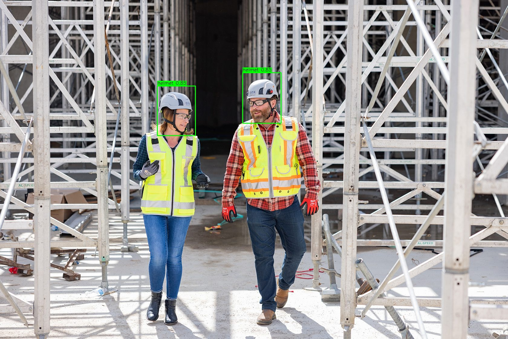

# Helmet Detection in Construction Sites Using YOLOv8 and PDE-Based Denoising

This project aims to detect whether construction workers are wearing helmets using YOLOv8 and improve detection accuracy by applying denoising techniques. The denoising process enhances the detection by reducing noise in images before processing them with the YOLOv8 model.

## Dataset

The dataset used for training the YOLOv8 model is the **Hard Hat Detection dataset** from Kaggle. The dataset consists of images that feature construction workers, some of whom are wearing helmets, and others who are not. The dataset can be accessed from the following link:

- [Hard Hat Detection Dataset - Kaggle](https://www.kaggle.com/datasets/andrewmvd/hard-hat-detection)

This dataset is used to train the YOLOv8 model for detecting whether a construction worker is wearing a helmet.


## Prerequisites

Before using the code, ensure you have the following Python libraries installed:

- **OpenCV**: For image processing.
- **NumPy**: For numerical operations.
- **Matplotlib**: For visualizing images.
- **Pillow**: For image handling and manipulation.
- **Google Colab (optional)**: For easy image uploads and cloud-based execution.

You can install these dependencies using the following pip commands:

## Prerequisites

Before using the code, ensure you have the following Python libraries installed:

- **OpenCV**: For image processing.
- **NumPy**: For numerical operations.
- **Matplotlib**: For visualizing images.
- **Pillow**: For image handling and manipulation.
- **Google Colab (optional)**: For easy image uploads and cloud-based execution.

You can install these dependencies using the following pip commands:

```bash
pip install opencv-python numpy matplotlib pillow
```

# Denoising Process

The denoising script applies a hybrid denoising method that combines three techniques to reduce image noise:

## Techniques Used:

1. **Bilateral Filtering**  
   - Preserves edges while reducing noise. It is especially useful for images with sharp edges or high contrast.

2. **ROF TVD Denoising**  
   - A Total Variation Denoising (TVD) method that uses Euler-Lagrange equations to preserve important image features while removing noise.

3. **Non-local Means Denoising**  
   - Further reduces noise by averaging similar pixels over a large neighborhood, improving image quality.

## Purpose

The denoising process helps improve the input image quality, which in turn enhances the detection accuracy of the YOLOv8 model, especially when working with noisy images.

## Usage

### Step 1: Upload Noisy Image
To begin the denoising process, upload a noisy image. The script will prompt you to upload the image from your local machine or Google Colab.

### Step 2: Apply Denoising Techniques
Once the image is uploaded, the script will apply the hybrid denoising method, which includes:
- Bilateral Filtering
- ROF TVD Denoising
- Non-local Means Denoising

```bash
python totalVarationDenoising.py
```

### Step 3: Review Processed Image
After the denoising process is complete, you can review the enhanced image, which should exhibit reduced noise and improved clarity.

### step 4: Train YOLOv8 Model
The YOLOv8 model is trained on the denoised images. You can configure the dataset and classes by modifying the `data_custom.yaml` file. The model will detect whether a worker is wearing a helmet and output bounding boxes around the detected helmets.

### step 5: Image Comparison
After denoising, both the original noisy image and the denoised image are saved and displayed side by side. This comparison visually demonstrates the effectiveness of the denoising process.

### step 6: Detection Results
The YOLOv8 model is used to detect helmets in the images. After processing the denoised images, the model's predictions (bounding boxes) are compared to the original noisy image, showing improvements in detection accuracy.

## Full Report

You can download the full project report from the link below:

[Download Full Report](https://drive.google.com/file/d/1epCAhby_fMzgOzFCZojcoowzAbN61KJa/view?usp=drive_link)


## Results


The following images demonstrate the effectiveness of the YOLOv8 helmet detection model before and after applying denoising techniques.

### Helmet Detection Results:




